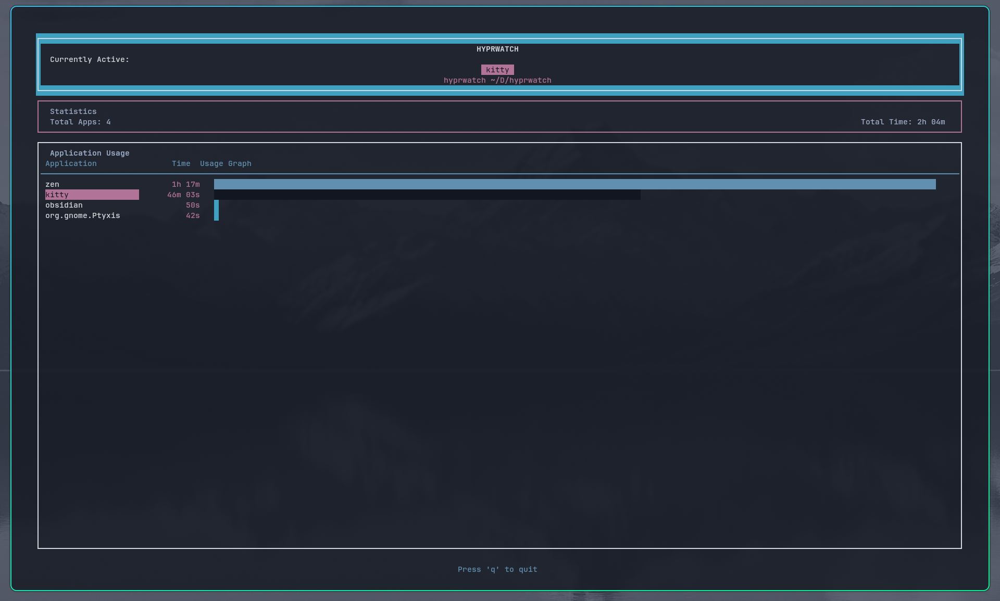

# Hyprwatch

A lightweight time tracking daemon and TUI client for Hyprland window manager.



## Features

- **Real-time window tracking** - Monitors active window changes via Hyprland IPC
- **Time accumulation** - Tracks time spent per application
- **TUI Client** - ncurses-based interface

## Requirements

- CMake (>= 3.16)
- C++17 compiler (gcc/clang)
- ncurses
- Hyprland (window manager)

## Installation & Usage

<details>
<summary>Platform-specific installation instructions</summary>

### Arch Linux

```bash
sudo pacman -S base-devel cmake ncurses git
git clone https://github.com/Farhan291/hyprwatch.git && cd hyprwatch
cmake -B build -S . -DCMAKE_BUILD_TYPE=Release
cmake --build build
sudo cmake --install build --prefix /usr/local

# Enable systemd service
systemctl --user daemon-reload
systemctl --user enable --now hyprwatchd

# Run client
hyprwatch
```

### Ubuntu/Debian

```bash
sudo apt update && sudo apt install -y build-essential cmake libncursesw5-dev
git clone https://github.com/Farhan291/hyprwatch.git && cd hyprwatch
cmake -B build -S . -DCMAKE_BUILD_TYPE=Release
cmake --build build
sudo cmake --install build --prefix /usr/local

# Enable systemd service
systemctl --user enable --now hyprwatchd

# Run client
hyprwatch
```

### Fedora

```bash
sudo dnf install cmake ncurses-devel gcc-c++ git
git clone https://github.com/Farhan291/hyprwatch.git && cd hyprwatch
cmake -B build -S . -DCMAKE_BUILD_TYPE=Release
cmake --build build
sudo cmake --install build --prefix /usr/local

# Enable systemd service
systemctl --user daemon-reload
systemctl --user enable --now hyprwatchd

# Run client
hyprwatch
```

### OpenSUSE

```bash
sudo zypper install cmake ncurses-devel gcc-c++ git
git clone https://github.com/Farhan291/hyprwatch.git && cd hyprwatch
cmake -B build -S . -DCMAKE_BUILD_TYPE=Release
cmake --build build
sudo cmake --install build --prefix /usr/local

# Enable systemd service
systemctl --user daemon-reload
systemctl --user enable --now hyprwatchd

# Run client
hyprwatch
```

### Nix

```bash
nix build github:Farhan291/hyprwatch

# Or install to profile
nix profile install github:Farhan291/hyprwatch
```

</details>

## Usage

### Start the daemon

```bash
# Using systemd (recommended)
systemctl --user daemon-reload
systemctl --user enable --now hyprwatchd

# Or run manually
hyprwatchd
```

### Run the client

```bash
hyprwatch
```

## Architecture

```
┌─────────────┐     IPC      ┌──────────────┐     Unix Socket     ┌─────────────┐
│  Hyprland   │◄────────────►│  hyprwatchd  │◄───────────────────►│  hyprwatch  │
│   (WM)      │   Events     │   (Daemon)   │    Data Request     │   (TUI)     │
└─────────────┘              └──────────────┘                     └─────────────┘
```

Hyprwatch uses a client-server architecture:

- **hyprwatchd** (daemon) - Background service that connects to Hyprland's IPC socket, tracks window focus changes, and maintains time statistics
- **hyprwatch** (client) - TUI application that connects to the daemon via Unix socket and displays real-time data

## License

Apache License 2.0 - See [LICENSE](LICENSE) for details.

Copyright 2026 Farhan

## References

- [Hyprland IPC Documentation](https://wiki.hypr.land/IPC/)
- [Systemd Services](https://linuxhandbook.com/create-systemd-services/)
- [Linux Sockets](https://www.linuxhowtos.org/C_C++/socket.htm)
